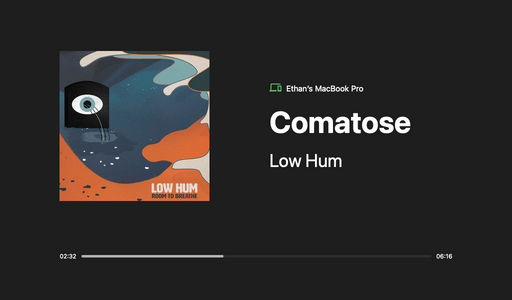

# Spotify Display

A simple interface designed to be run on a Raspberry Pi hooked up to a 1024x600px display. Shows information about the currently playing song including title, artist, album art and progress, as well as device name.

Uses a Python backend to interface with the Spotify API using the Spotipy Python wrapper. Information is handed over to a locally hosted Vanilla JS front end for presentation.

## Usage

1. Install spotipy - the python spotify api wrapper - with `pip3 install spotipy`

2. Run the server using `python get_spotify_data.py <spotify username>`

3. Open index.html in a browser

4. Play music on Spotify using the account you used to run the server... the info should appear in the browser.

## Preview

